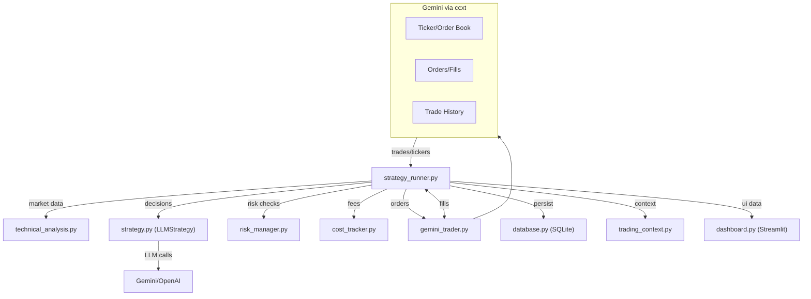
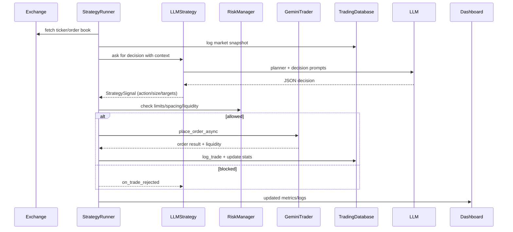

# Architecture

Concise view of how the bot fits together, with a sentence per component and two quick diagrams to keep it maintainable.

## System Diagram

## Loop Sequence (happy path)

## Components (one-liners)
- `strategy_runner.py`: Orchestrates the loop, wires services, enforces spacing/slippage/liquidity/risk, and logs everything.
- `strategy.py` (`LLMStrategy`): Builds planner/decision prompts, normalizes tool hints, sizes trades, and handles cooldowns.
- `trading_context.py`: Packages positions, orders, summaries, and regime flags for the LLM.
- `technical_analysis.py`: Computes RSI, MACD, Bollinger Bands, SMAs, and simple signal summaries.
- `risk_manager.py`: Enforces order value, exposure caps, position count, and daily loss guardrails.
- `gemini_trader.py`: ccxt adapter for Gemini with precision fixes, post-only handling, and order/trade sync.
- `cost_tracker.py`: Estimates exchange fees and LLM token costs for net PnL.
- `database.py`: SQLite schema/helpers for sessions, trades, prompts/traces, OHLCV, equity, positions, open orders, commands, and trade plans.
- `dashboard.py`: Streamlit UI for performance, costs, health, history, logs, and control commands.
- `config.py`: Central tunables for API keys, limits, cadence, and modes.
