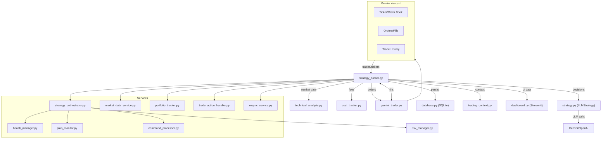
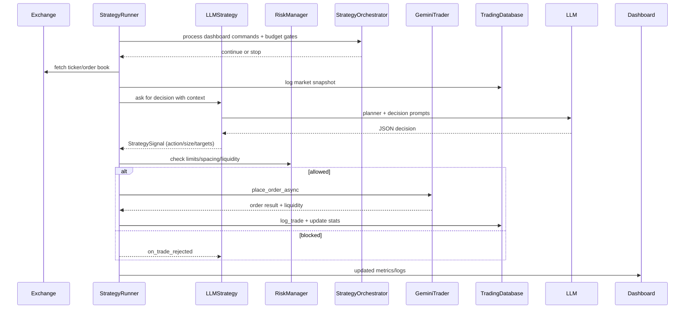

# Architecture

Concise view of how the bot fits together, with a sentence per component and two quick diagrams to keep it maintainable.

## System Diagram

## Loop Sequence (happy path)

## Delegation Boundaries
- `StrategyRunner` owns the loop clock and session lifecycle, but defers command handling and stop logic to `StrategyOrchestrator`.
- `StrategyOrchestrator` fans out to `CommandProcessor`, `HealthCircuitManager`, `PlanMonitor`, and `RiskManager` so the loop body stays thin.
- Market capture and pruning run through `MarketDataService`; trade executions/plan updates route via `TradeActionHandler`.
- Holdings, PnL, and fee/LLM cost accounting live in `PortfolioTracker`, while `ResyncService` handles state reconciliation on startup and trade sync inside the loop.

## Components (one-liners)
- `strategy_runner.py`: Thin orchestrator loop that wires services, hands telemetry/risk gating to `StrategyOrchestrator`, and owns the trading lifecycle.
- `services/strategy_orchestrator.py`: Lifecycle harness for start/stop/cleanup, command processing, budget gates, plan monitor coordination, and market-data health checks.
- `services/command_processor.py`: Executes dashboard-issued commands (stop bot, close positions) ahead of each loop.
- `services/plan_monitor.py`: Manages open plan stops/targets, trailing rules, and auto-flatten windows.
- `services/health_manager.py`: Circuit breaker for exchange/tool streaks plus market-data staleness/latency gating.
- `services/market_data_service.py`: OHLCV capture/pruning helpers and timeframe parsing for cadence guards.
- `services/portfolio_tracker.py`: Tracks holdings and session stats, rebuilds from exchange trades, and persists caches.
- `services/trade_action_handler.py`: Executes plan actions (update/partial/close/pause), RR filters, slippage checks, and liquidity guards.
- `services/resync_service.py`: Reconciles DB snapshots with exchange state and syncs recent trades on startup and during loops.
- `strategy.py` (`LLMStrategy`): Builds planner/decision prompts, normalizes tool hints, sizes trades, and handles cooldowns.
- `trading_context.py`: Packages positions, orders, summaries, and regime flags for the LLM.
- `technical_analysis.py`: Computes RSI, MACD, Bollinger Bands, SMAs, and simple signal summaries.
- `risk_manager.py`: Enforces order value, exposure caps, position count, and daily loss guardrails.
- `gemini_trader.py`: ccxt adapter for Gemini with precision fixes, post-only handling, and order/trade sync.
- `cost_tracker.py`: Estimates exchange fees and LLM token costs for net PnL.
- `database.py`: SQLite schema/helpers for sessions, trades, prompts/traces, OHLCV, equity, positions, open orders, commands, and trade plans.
- `dashboard.py`: Streamlit UI for performance, costs, health, history, logs, and control commands.
- `config.py`: Central tunables for API keys, limits, cadence, and modes.
