# Architecture Overview

This repo runs a single-symbol, Gemini-focused trading loop with an LLM-driven strategy, deterministic risk overlays, and rich telemetry. The runner orchestrates market data capture, strategy prompts, risk gating, execution, and persistence into SQLite plus structured logs.

## Component Map

## Loop Lifecycle (happy path)

```mermaid
sequenceDiagram
    participant Exchange
    participant Runner as StrategyRunner
    participant Strategy as LLMStrategy
    participant Tools as DataFetchCoordinator
    participant Risk as RiskManager
    participant Trader as GeminiTrader
    participant DB as TradingDatabase

    Runner->>Exchange: fetch_ticker/order_book (market snapshot)
    Runner->>DB: log market_data, refresh positions/open_orders
    Runner->>Tools: (optional) tool requests from planner
    Tools->>Exchange: fetch_ohlcv/fetch_trades/fetch_order_book
    Tools-->>Runner: normalized tool_responses
    Runner->>Strategy: generate_signal(session_id, market_data,…)
    Strategy->>LLM: planner + decision prompts (telemetry logged)
    LLM-->>Strategy: decision JSON
    Strategy-->>Runner: StrategySignal(stop/target/plan ids)
    Runner->>Risk: check_trade_allowed + exposure headroom
    alt allowed & RR/liq/slippage pass
        Runner->>Trader: place_order_async(prefer maker)
        Trader-->>Runner: order result + liquidity
        Runner->>DB: log_trade / trade_plan / stats cache
    else blocked
        Runner->>Strategy: on_trade_rejected(reason)
    end
    Runner->>DB: telemetry + open_orders snapshot
    Runner->>Runner: sleep LOOP_INTERVAL_SECONDS
```

## Responsibilities (by module)
- [`trader_bot/strategy_runner.py`](components/strategy_runner.md): main loop; wires exchange, risk, TA, cost tracking, tool coordinator; enforces spacing, slippage, liquidity, RR, plan monitoring; owns telemetry and session stats cache.
- [`trader_bot/strategy.py` / `LLMStrategy`](components/strategy.md): builds planner+decision prompts, normalizes tool requests, clamps stop/target band, sizes within exposure/order caps, and tracks cooldown/break-glass/fee regimes.
- [`trader_bot/trading_context.py`](components/trading_context.md): maintains the structured context surfaced to the LLM (positions, open orders, summaries) and supports regime flags.
- [`trader_bot/data_fetch_coordinator.py`](components/strategy_runner.md#flow): validates tool requests, caches OHLCV/books/trades, and normalizes payloads with byte-size clamping before returning to the LLM.
- [`trader_bot/risk_manager.py`](components/risk_manager.md): order value/min size, exposure caps, position count caps, pending order exposure tracking, and daily loss guard (percent & absolute) seeded from persisted equity.
- [`trader_bot/gemini_trader.py`](components/gemini_trader.md): ccxt adapter with sandbox precision backfill, ticker/order book fetch, limit order placement with post-only retry, positions/open orders/equity sync, trade history fetch.
- [`trader_bot/database.py`](components/database.md): SQLite schema and helpers for sessions, trades, prompts/traces, OHLCV, equity, positions/open orders, commands, and trade plans; caches session stats for restart resilience.
- [`trader_bot/technical_analysis.py`](components/technical_analysis.md): RSI/MACD/Bollinger/SMA calculations and formatted signals for context or regime flags.
- [`trader_bot/cost_tracker.py`](components/cost_tracker.md): calculates trading fees per exchange and LLM token costs; derives net PnL.
- [`trader_bot/dashboard.py`](components/dashboard.md): Streamlit UI for monitoring session stats, trade history, exposure, logs, and issuing control commands (stop/close-all).

## Data & Telemetry
- SQLite (`trading.db`) stores sessions, trades, LLM calls/traces, OHLCV, equity snapshots, positions, open orders, commands, and trade plans; session stats cached for warm restarts.
- Logs: `bot.log` (user-facing decisions), `console.log` (debug), `telemetry.log` (JSON prompts/responses/tool traces, execution outcomes).
- Prompt artifacts: `trader_bot/llm_prompt_template.txt` drives both planner and decision prompts with context/rule blocks.
- See also: [Domain Model](domain_model.md) for entity relationships and persistence layout.
